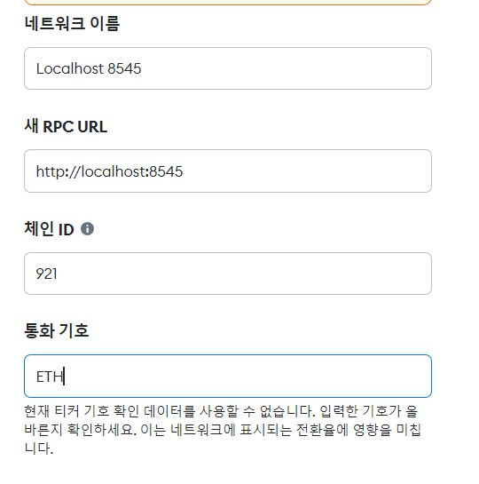
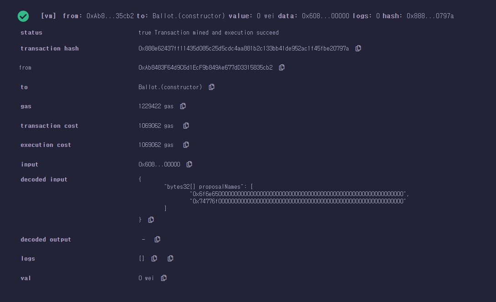
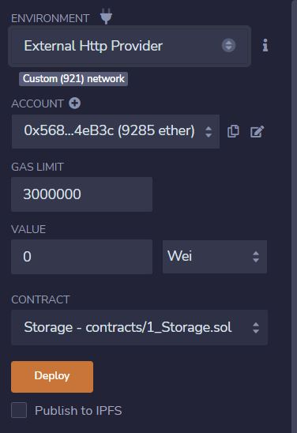

# 명세서 학습

## 22.08.29

1. 스켈레톤 프로젝트 개발환경 구성
   
   - 스켈레톤 코드 내려받기
   
   - virtualBox 및 Vagrant 설치
   
   - vagrant를 활용한 가상머신 생성 및 구동

## 22.08.30

1. 문제 해결 : vagrant up 중 Timeout 발생


- 해결 : PowerShell에서 VirtualMachinePlatform 비활성화

- dism.exe /online /Enable-Feature /FeatureName:VirtualMachinePlatform /all /NoRestart
2. eth0 실행 후 geth 설치

```c
sudo apt-get update
sudo apt-get install software-properties-common
sudo add-apt-repository -y ppa:ethereum/ethereum
sudo apt-get install ethereum
```

3. 폴더 생성 후 계정 생성 및 genesis 작성

```c
{
   "config": {
      "chainId": 921,
      "homesteadBlock": 0,
      "eip150Block": 0,
      "eip155Block": 0,
      "eip158Block": 0
   },
   "difficulty": "0x10",
   "nonce": "0xdeadbeefdeadbeef",
   "gasLimit": "9999999",
   "timestamp": "0x0",
   "alloc": {}
}
```

4. private network 생성

```c
geth --datadir . init genesis
```

5. private network 구동

```c
geth --networkid 921 --nodiscover --maxpeers 2 --datadir ~/dev/eth_localdata --http --http.addr "0.0.0.0" --http.port 8545 --http.corsdomain "*" --http.api "db,eth,debug,miner,net,personal,web3"
```

## 22.08.31

1. 계정 생성 및 확인

```c
personal.newAccount("비밀번호")
eth.accounts
```

2. 코인베이스 설정
   
   - 초기 코인베이스는 eth.accounts[0]
   
   - 변경하기
   
   ```C
   miner.setEtherbase(eth.accounts[1])
   ```
   
   - 블록체인 블록 개수 확인하기
   
   ```c
   eth.blockNumber    
   ```

3. 채굴하기
   
   - miner.start()로 시작됐는지 확인할 수 없으므로 eth.mining을 통해 채굴중인지 확인
   
   ```C
   miner.start()
   eth.mining
   ```
   
   - 해시 속도와 블록 길이 확인
   
   ```c
   eth.hashrate
   eth.blockNumber
   ```
   
   - 채굴 종료하기
   
   ```C
   miner.stop
   ```
   
   - 채굴 결과 확인하기
   
   ```c
   eth.getBalance(eth.coinbase)
   eth.getBalance(eth.accounts[0])
   web3.fromWei(eth.getBalance(eth.accounts[0]), "ether")
   ```

4. 송금하기
   
   - 문제 발생 : 송금할 계정에 unlock하는 명령어가 먹히지 않음
   
   - 해결방법 : 네트워크 구동 시 --allow-insecure-unlock 추가
   
   ```C
   geth --networkid 921 --nodiscover --maxpeers 2 --datadir ~/dev/eth_localdata --http --http.addr "0.0.0.0" --http.port 8545 --http.corsdomain "*" --http.api "db,eth,debug,miner,net,personal,web3" --allow-insecure-unlock console
   ```
   
   - 송금할 계정 unlock하기
   
   ```C
   personal.unlockAccount(eth.accounts[0], "비밀번호")
   ```
   
   - 트랜잭션 생성 및 전송
   
   ```C
   eth.sendTransaction({from:eth.accounts[0], to:eth.accounts[1], value:web3.toWei(10, "ether")})
   eth.getTransaction("트랜잭션 ID")
   ```
   
   - 트랜잭션 처리를 위한 채굴 진행
   
   ```c
   miner.start(1)
   eth.pendingTransactions
   miner.stop()
   eth.getTransaction("트랜잭션 ID")
   eth.getBloc(블록번호)
   ```

## 22.09.01

- eth0과 eth1 연결

- 사전준비 : eth1을 eth0과 같은 세팅 진행
1. eth1의 enode확인

```C
admin.nodeInfo.enode
```

2. ifconfig로  IP주소 확인 후 node의 뒷 부분에 IP주소를 기입

3. eth0에 eth1의 enode등록

```c
admin.addPeer("eth1의 enode")
```

4. eth1에서 eth0 관련 정보를 address값을 활용해 조회할 수 있다.

## 22.09.02

1. Metamask에 eth0 계정 연동
   
   - keystore에 있는 계정 json파일을 생성
   
   - Metamask에 8545 네트워크 생성
   
   
   
   - 계정 가져오기 기능을 통해 eth0의 코인베이스 계정 가져오기
   
   

### 스마트 컨트랙트

1. 컴파일되고 실행되는 프로그램
   
   - 불변의 프로그램
   
   - 실행한 결과가 모두 같으며
   
   - EVM위에서 동작
   
   - 탈중앙화된 World Computer 동일한 상태를 유지

2. 배포과정
   
   - 스마트 컨트랙트 작성(ABI 생성)
   
   - 컴파일을통해 바이트 코드 생성
   
   - 트랜잭션을 배포(CA 생성), 블록에 담음
   
   - 네트워크에 블록 처리하여 동기화

3. 호출
   
   - 사용자계정(EOA), CA, ABI, 함수의 주소, 매개변수를 요구
   
   - 컨트랙트 호출 트랜잭션 생성 및 처리
   
   - 블록에 담은 후 네트워크에 블록 전파, 트랜잭션 실행
   
   - 블록 동기화
   
   - 

### Remix IDE

- 개발 환경 설정 없이 스마트 컨트랙트를 작성하고 배포, 호출할 수 있음

- 환경 설정 후 주어진 계정을 활용해 Tx를 자유롭게 전송해볼 수 있다.



1. eth0과 Remix연동 후 트랜잭션 전송하기
   
   - localhost 8545연결
   
   

2. 송금할 계정 unlock
   
   ```c
   web3.eth.personal.unlockAccount("add", "password", sec)
   ```
   
   - 트랜잭션 송금 시 creation of Storage pending에서 진행되지 않는 문제가 발생해서 해결중
