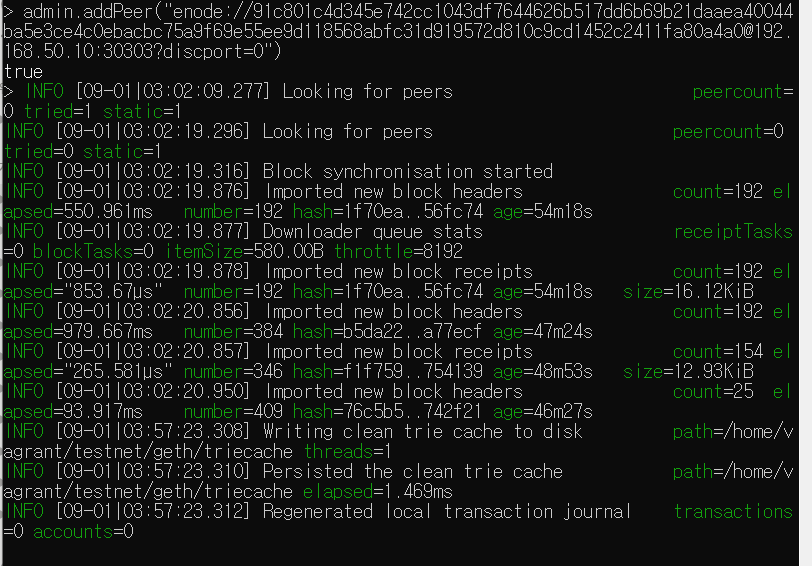
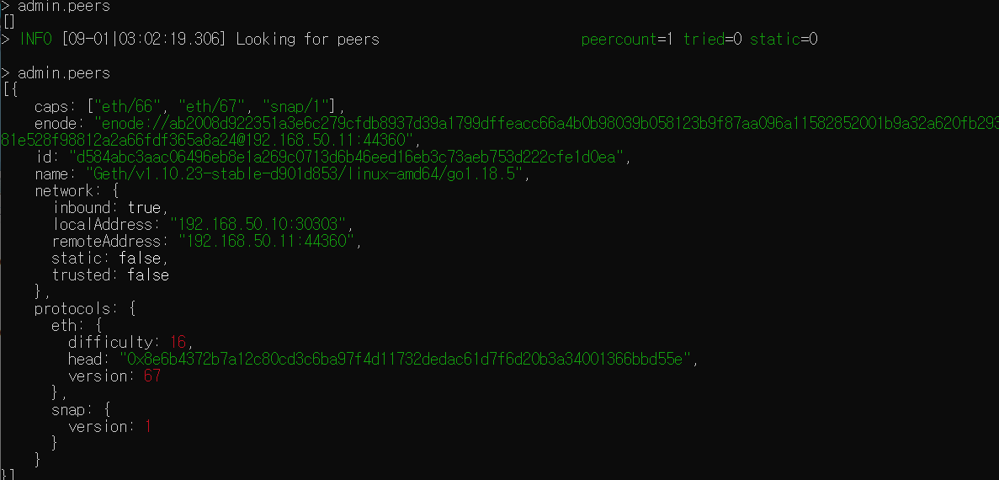
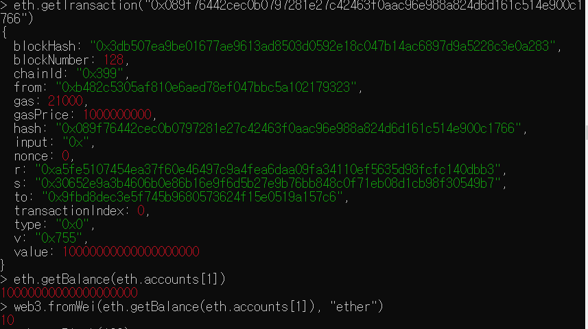
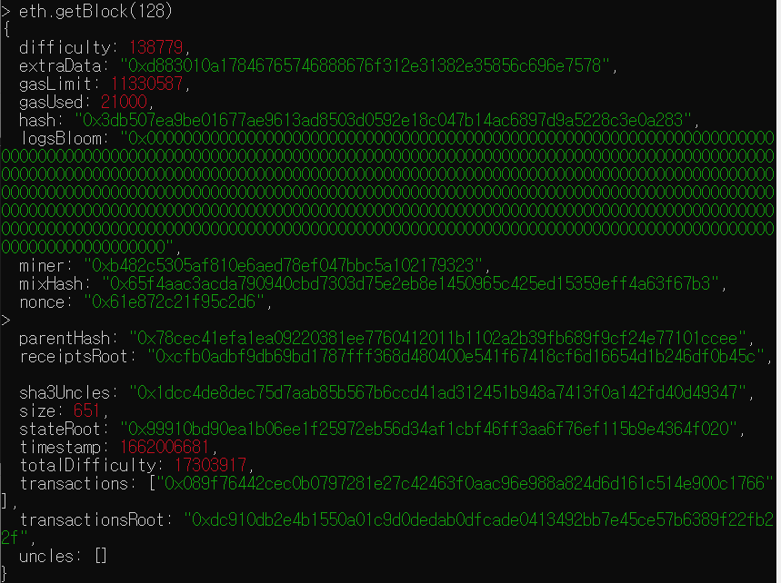
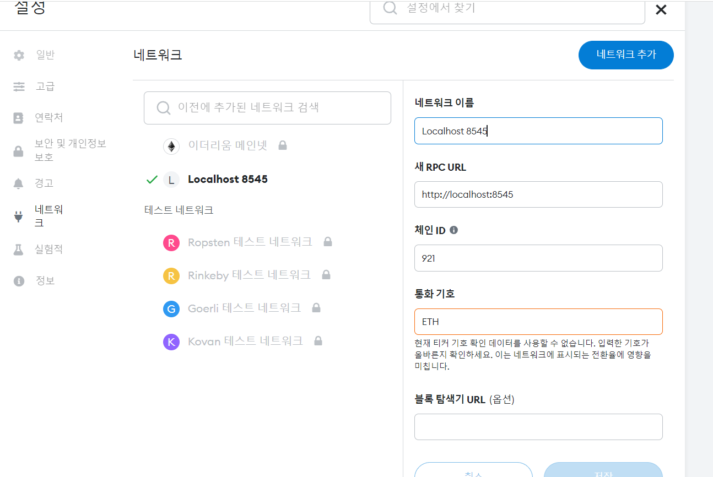
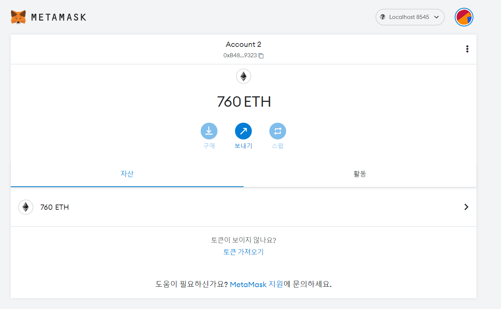
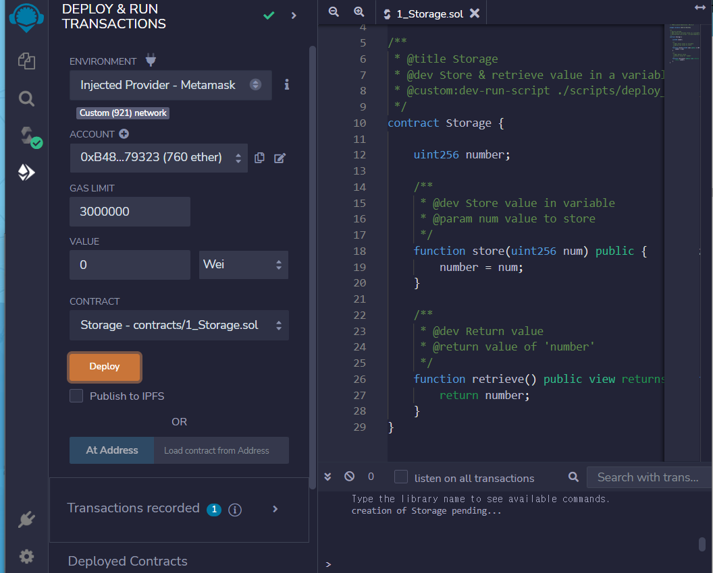
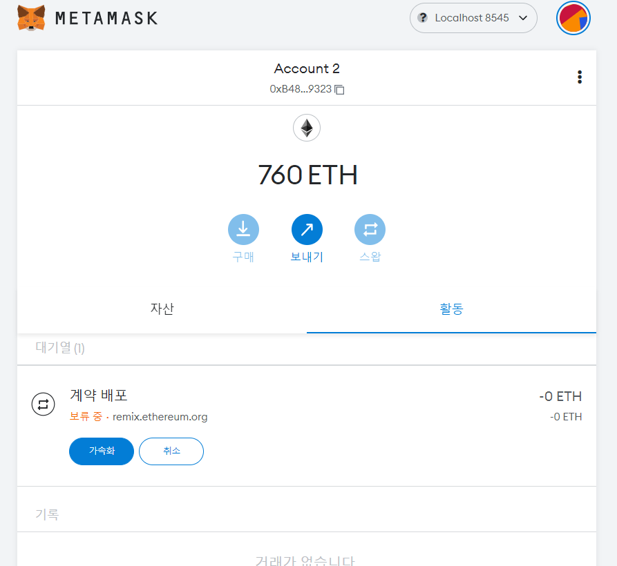
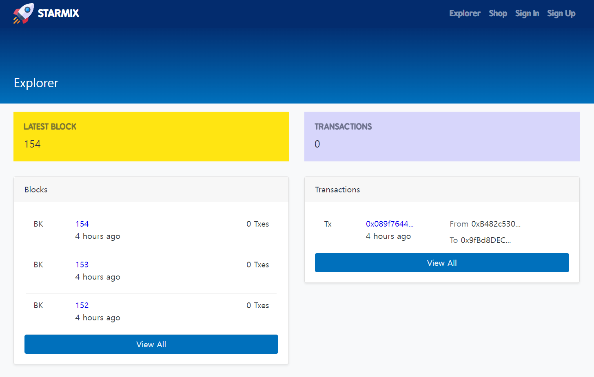

- pjt1

  - **Req. 1 프라이빗 이더리움 네트워크 구축**

    - 1-1. 가상머신 구성
      - VirtualBox 설치
      - Vagrant 설치
      - 이더리움 네트워크 구축용 VM 2대 생성
    - 1-2. 이더리움 eth0 노드 구성

      - 이더리움 소프트웨어는 Geth 1.9(stable) 이상을 사용
      - Geth는 가상 머신 상에서 동작하도록 구축
      - eth0 노드의 경우 RPC API를 호출할 수 있도록 활성화

      ***

      $ vagrant version
      $ vagrant plugin install vagrant-scp
      $ vagrant init
      vagrantfile 수정

      ```makefile
      # -*- mode: ruby -*-
      # vi: set ft=ruby :

      # All Vagrant configuration is done below. The "2" in Vagrant.configure
      # configures the configuration version (we support older styles for
      # backwards compatibility). Please don't change it unless you know what
      # you're doing.

      VAGRANT_API_VERSION = "2"

      vms = {
         'eth0' => '10',
         'eth1' => '11'
      }

      Vagrant.configure(VAGRANT_API_VERSION) do |config|
         config.vm.box = "ubuntu/bionic64"
         vms.each do |key, value|
            config.vm.define "#{key}" do |node|
               node.vm.network "private_network", ip: "192.168.50.#{value}"
               if "#{key}" == "eth0"
                  node.vm.network "forwarded_port", guest: 8545, host: 8545
               end
               node.vm.hostname = "#{key}"
               node.vm.provider "virtualbox" do |nodev|
                  nodev.memory = 2048
                  nodev.cpus = 2
               end
            end
         end
      end
      ```

      $ vagrant up
      $ vagrant status
      $ vagrant up eth0
      $ vagrant provision
      $ vagrant ssh eth0
      $ sudo apt-get update
      $ sudo apt-get install software-properties-common
      $ sudo add-apt-repository -y ppa:ethereum/ethereum
      $ sudo apt-get install ethereum
      mkdir -p dev/eth_localdata
      cd dev/eth_localdata
      vi genesis.json

      ```json
      {
        "config": {
          "chainId": 921,
          "homesteadBlock": 0,
          "eip150Block": 0,
          "eip155Block": 0,
          "eip158Block": 0
        },
        "difficulty": "0x10",
        "nonce": "0xdeadbeefdeadbeef",
        "timestamp": "0x0",
        "gasLimit": "9999999",
        "alloc": {}
      }
      ```

      - eth0
        geth --networkid 921 --nodiscover --maxpeers 2 --datadir ~/dev/eth_localdata --http --http.addr "0.0.0.0" --http.port 8545 --http.corsdomain "\*" --http.api "db,eth,debug,miner,net,personal,web3" --allow-insecure-unlock console
      - eth1
        geth --networkid 921 --nodiscover --maxpeers 2 --datadir ~/dev/eth_localdata --allow-insecure-unlock console

    - 1-3. 이더리움 eth1 노드 구성
      - 이더리움 소프트웨어는 Geth 1.9 (stable) 이상을 사용
      - Geth는 가상 머신 상에서 동작하도록 구축

  ***

  - Req 2. **이더리움 계정 생성**
    Geth 콘솔에서 명령어 사용
    - 2-1 계정 생성
      - 사용자 계정은 노드마다 최소 1개 이상 생성
      - 계정 생성에 따른 keystore 파일 확인
    - 2-2 코인 베이스(Coinbase) 설정
      - 코인베이스: 블록 생성에 따른 보상금 지급 계정
      - 노드마다 생성한 계정 중 하나를 코인베이스로 설정
    - 2-3 마이닝(Mining) 시작
      - 모든 노드에서 마이닝 시작
      - 마이닝 진행 상태 확인
      - 일정량 마이닝 진행 후 중단(가상머신에서 구동하는 환경 상 호스트 PC에 발생하는 부하를 고려하여 중단)
    - 2-4 마이닝(Mining) 결과 확인
      - 계정별 잔액 확인
      - 생성된 블록 수 조회
      - 블록의 상세 정보 조회
    ***
    피어 연결 ([http://blockchaindev.kr/models/content/88](http://blockchaindev.kr/models/content/88))
    admin.nodeInfo.enode
    admin.addPeer("enode://91c801c4d345e742cc1043df7644626b517dd6b69b21daaea40044ba5e3ce4c0ebacbc75a9f69e55ee9d118568abfc31d919572d810c9cd1452c2411fa80a4a0@192.168.50.10:30303?discport=0")
    true
    
    admin.peers
    
    ***
  - **Req.3 이더리움 트랜잭션 생성**
    Geth 콘솔에서 명령어 사용
    - 3-1. 트랜잭션(Transaction) 생성
      - 계정 간 이더(ETH) 전송 트랜잭션 생성
      - 전송할 이더량은 임의로 지정
      - 트랜잭션 해시 값 확인
      - 트랜잭션 상태 조회
    - 3-2. 트랜잭션(Transaction) 결과 확인
      - 마이닝 재시작(일정 시간 수행)
      - 트랜잭션 상태 조회
      - 마이닝에 따른 트랜잭션 처리가 완료되면 마이닝 중단

  ***

  personal.unlockAccount(eth.accounts[0], "test1")
  
  

  ***

  - Req.4 스마트 컨트랜트 배포
    - 4-1. eth0 노드 확인
      - VirtualBox 또는 Vagrant에서 eth0 VM에 대한 포트 포워딩 확인 - Host 8545 → Guest 8545
      - eth0의 keystore를 json 파일로 저장
        ```json
        {
          "address": "b482c5305af810e6aed78ef047bbc5a102179323",
          "crypto": {
            "cipher": "aes-128-ctr",
            "ciphertext": "27f4d0d11cf69d4cac901c532bf0aff35e3c2c1167b325951a21279524da9332",
            "cipherparams": { "iv": "3443039a38887b6a768963a347d80b5a" },
            "kdf": "scrypt",
            "kdfparams": {
              "dklen": 32,
              "n": 262144,
              "p": 1,
              "r": 8,
              "salt": "93ab5908e9bd4ab954ef36821531f761ea69001cfa3f000567163df80186aaa5"
            },
            "mac": "d48c05621dc8534d0ead735c8218ca4b67f6d80a7728151905343e937d4e8ee4"
          },
          "id": "224e96cb-e90e-4778-8d95-8051c64c2af0",
          "version": 3
        }
        ```
    - 4-2. Metamask 설정
      - Chrome 확장 프로그램 검색
      - Metamask 설치 및 실행
      - Metamask의 Custom RPC 옵션 설정
      - Metamask에서 계정 Import(eht0의 keystone json파일 활용)
      - Metamask에서 계정 및 잔액 정보 확인
      ***
      
      
      ***
    - 4-3. 스마트 컨트랙트 배포(Remix)
      - Remix 접속
      - Deploy & Run Transactions으로 이동
      - Environment를 로컬 이더리움 네트워크와 연동
      - 기본 제공 예제 중 1개를 선택하여 코드 내용 확인
      - Comile 및 Deploy 수행 후 결과 확인
      ***
      
      
      
      ***
    - 블록 정보 조회
      - 스켈레톤 프로젝트의 이더리움 네트워크 정보를 맞게 수정
      - 스켈레톤 프로젝트 구동
      - 각 블록 및 트랜잭션 정보 확인
      ***
      npm i
      npm run serve
      
