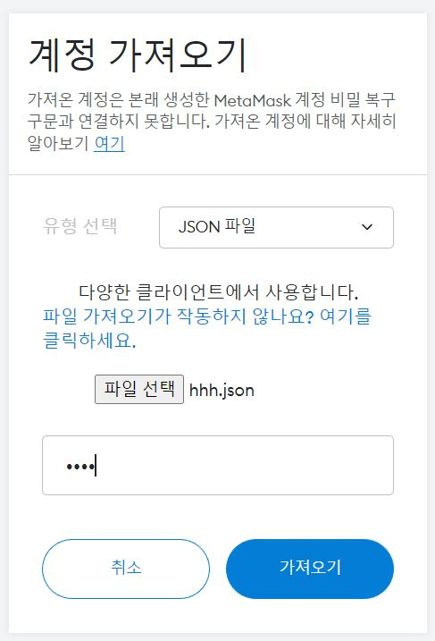

# 명세서 학습

## 22.08.29

1. 스켈레톤 프로젝트 개발환경 구성
   
   - 스켈레톤 코드 내려받기
   
   - virtualBox 및 Vagrant 설치
   
   - vagrant를 활용한 가상머신 생성 및 구동

## 22.08.30

1. 문제 해결 : vagrant up 중 Timeout 발생


- 해결 : PowerShell에서 VirtualMachinePlatform 비활성화

- dism.exe /online /Enable-Feature /FeatureName:VirtualMachinePlatform /all /NoRestart
2. eth0 실행 후 geth 설치

```c
sudo apt-get update
sudo apt-get install software-properties-common
sudo add-apt-repository -y ppa:ethereum/ethereum
sudo apt-get install ethereum
```

3. 폴더 생성 후 계정 생성 및 genesis 작성

```c
{
   "config": {
      "chainId": 921,
      "homesteadBlock": 0,
      "eip150Block": 0,
      "eip155Block": 0,
      "eip158Block": 0
   },
   "difficulty": "0x10",
   "nonce": "0xdeadbeefdeadbeef",
   "gasLimit": "9999999",
   "timestamp": "0x0",
   "alloc": {}
}
```

4. private network 생성

```c
geth --datadir . init genesis
```

5. private network 구동

```c
geth --networkid 921 --nodiscover --maxpeers 2 --datadir ~/dev/eth_localdata --http --http.addr "0.0.0.0" --http.port 8545 --http.corsdomain "*" --http.api "db,eth,debug,miner,net,personal,web3"
```

## 22.08.31

1. 계정 생성 및 확인

```c
personal.newAccount("비밀번호")
eth.accounts
```

2. 코인베이스 설정
   
   - 초기 코인베이스는 eth.accounts[0]
   
   - 변경하기
   
   ```C
   miner.setEtherbase(eth.accounts[1])
   ```
   
   - 블록체인 블록 개수 확인하기
   
   ```c
   eth.blockNumber    
   ```

3. 채굴하기
   
   - miner.start()로 시작됐는지 확인할 수 없으므로 eth.mining을 통해 채굴중인지 확인
   
   ```C
   miner.start()
   eth.mining
   ```
   
   - 해시 속도와 블록 길이 확인
   
   ```c
   eth.hashrate
   eth.blockNumber
   ```
   
   - 채굴 종료하기
   
   ```C
   miner.stop
   ```
   
   - 채굴 결과 확인하기
   
   ```c
   eth.getBalance(eth.coinbase)
   eth.getBalance(eth.accounts[0])
   web3.fromWei(eth.getBalance(eth.accounts[0]), "ether")
   ```

4. 송금하기
   
   - 문제 발생 : 송금할 계정에 unlock하는 명령어가 먹히지 않음
   
   - 해결방법 : 네트워크 구동 시 --allow-insecure-unlock 추가
   
   ```C
   geth --networkid 921 --nodiscover --maxpeers 2 --datadir ~/dev/eth_localdata --http --http.addr "0.0.0.0" --http.port 8545 --http.corsdomain "*" --http.api "db,eth,debug,miner,net,personal,web3" --allow-insecure-unlock console
   ```
   
   - 송금할 계정 unlock하기
   
   ```C
   personal.unlockAccount(eth.accounts[0], "비밀번호")
   ```
   
   - 트랜잭션 생성 및 전송
   
   ```C
   eth.sendTransaction({from:eth.accounts[0], to:eth.accounts[1], value:web3.toWei(10, "ether")})
   eth.getTransaction("트랜잭션 ID")
   ```
   
   - 트랜잭션 처리를 위한 채굴 진행
   
   ```c
   miner.start(1)
   eth.pendingTransactions
   miner.stop()
   eth.getTransaction("트랜잭션 ID")
   eth.getBloc(블록번호)
   ```

## 22.09.01

- eth0과 eth1 연결

- 사전준비 : eth1을 eth0과 같은 세팅 진행
1. eth1의 enode확인

```C
admin.nodeInfo.enode
```

2. ifconfig로  IP주소 확인 후 node의 뒷 부분에 IP주소를 기입

3. eth0에 eth1의 enode등록

```c
admin.addPeer("eth1의 enode")
```

4. eth1에서 eth0 관련 정보를 address값을 활용해 조회할 수 있다.

## 22.09.02

1. Metamask에 eth0 계정 연동
   
   - keystore에 있는 계정 json파일을 생성
   
   - Metamask에 8545 네트워크 생성
   
   
   
   - 계정 가져오기 기능을 통해 eth0의 코인베이스 계정 가져오기
   
   

### 스마트 컨트랙트

1. 컴파일되고 실행되는 프로그램
   
   - 불변의 프로그램
   
   - 실행한 결과가 모두 같으며
   
   - EVM위에서 동작
   
   - 탈중앙화된 World Computer 동일한 상태를 유지

2. 배포과정
   
   - 스마트 컨트랙트 작성(ABI 생성)
   
   - 컴파일을통해 바이트 코드 생성
   
   - 트랜잭션을 배포(CA 생성), 블록에 담음
   
   - 네트워크에 블록 처리하여 동기화

3. 호출
   
   - 사용자계정(EOA), CA, ABI, 함수의 주소, 매개변수를 요구
   
   - 컨트랙트 호출 트랜잭션 생성 및 처리
   
   - 블록에 담은 후 네트워크에 블록 전파, 트랜잭션 실행
   
   - 블록 동기화
   
   - 

### Remix IDE

- 개발 환경 설정 없이 스마트 컨트랙트를 작성하고 배포, 호출할 수 있음

- 환경 설정 후 주어진 계정을 활용해 Tx를 자유롭게 전송해볼 수 있다.


1. eth0과 Remix연동 후 트랜잭션 전송하기
   
   - localhost 8545연결
   
   

2. 송금할 계정 unlock
   
   ```c
   web3.eth.personal.unlockAccount("add", "password", sec)
   ```
   
   - 트랜잭션 송금 시 creation of Storage pending에서 진행되지 않는 문제가 발생해서 해결중

## 22.09.14

- cmd, Powershell, intelliJ 등 명령어를 찾을 수 없는 이슈가 발생해서 문제를 지속적으로 해결하기위해 조사

- 환경변수의 Path가 모두 지워져있어 복구 완료, 개발을 다시 진행

### 솔리디티 개발환경 구성

1. trufflesuite 설치
   
   - 스마트컨트랙트를 개발하는데 있어 테스트, 배포, 운영 등을 쉽게 도와주는 툴

```shell
npm install -g truffle
```

2. ATOM에디터 설치
   
   - 솔리디티 및 이더리움 개발 도구
   
   - https://atom.io/

3. Metacoin tutorial 설치
   
   ```shell
   truffle unbox metacoin
   ```

### sol 파일 레이아웃

```solidity
//SPDX-License-Identifier: GPL-3.0
pragma solidity >=0.7.0 < 0.8.0
```

- 소스코드의 SPDX라이선스를 명시

- 소스코드가 이용하는 솔리디티 컴파일러 버전 명시

```solidity
contract Storage {
    uint256 number;

    function store(uint256 num) public {
        number = num;
    }
    function retrieve() public view returns(uint256){
        //retrun이 있는 경우 함수 선언에서 언급
        return number;
    }
}
```

- contract Storage{} : 컨트랙트 범위

- 상태변수
  
  - 블록체인에 상태가 동기화되는 변수
  
  - 접근 제어자 지정 가능
  
  - ex) uint: 부호없는 정수

- 함수
  
  - 컨트랙트의 단위 기능
  
  - 매개 변수, 제어자, 반환값 지정 가능

### solidity 문법 공부

```solidity
contract fund{
    uint public constant MINIMUM_AMOUNT = 1e16;
    uint public fundRaisingCloses;
    address public beneficiary;

    constructor (uint _duration, address _beneficiary) {
        fundRaisingCloses = block.timestamp + _duration;
        beneficiary = _beneficiary;

    address[] funders;

    function fund() public payable {

        // if (msg.value >= MINIMUM_AMOUNT) {
        //     if (block.timestamp < fundRaisingCloses) {

        //     }
        // }
        require(msg.value >= MINIMUM_AMOUNT, "MINIMUM AMOUNT: 0.01 ether");
        require(block.timestamp < fundRaisingCloses, "FUND RAISING CLOSED");
        address funder = msg.sender;
        funders.push(funder);

    }

    function currentCollection() public view returns(uint256) {
        return address(this).balance;
    }

    function withdraw() public payable onlyBeneficiary{
        require(block.timestamp > fundRaisingCloses, "not yet");
        // msg.sender.transfer(address(this).balance);
        payable(msg.sender).transfer(address(this).balance);
        // address payable owner = msg.sender;

    }
    }}
```

- constructor : 컨트랙트가 배포될 때 호출되는 특수 함수

- uint duration : 모금의 유효 시간을 의미(3600 = 1시간)

- 정수형 연산자 '+' : 현재 타임스탬프 + duration을 종료 시간으로 지정

- block.timestamp : 특수 전역 변수 중 하나, 현재 시각의 유닉스 타임 스탬프 값

- beneficiary : 펀드 수혜자

- 최소 모금액 = 0.01 ether(1ether = 10^18Wei)

- 밑에 함수는 모금, 현재 모금액, 수령하기
1. fund()
   
   - if / require(판별문, 에러메시지) : 유효성 검사 구문, true가 아니면 바로 종료
   
   - address : 이더리움 주소를 저장할 수 있는 자료형
   
   - msg.sender : 메시지 송신자를 알 수 있는 전역변수(펀딩한 사람 address)
   
   - 자료형의 배열
     
     - uint[4] fixedArray;
     
     - uint[] dynamicArray;

2. currentCollection()
   
   - 함수 반환문 작성
   
   - view : 상태 변수에 변화를 가하지 않고 읽기만 하는 함수

3. withdraw()
   
   - 기한이 종료된 뒤 누적된 이더를 받는다.